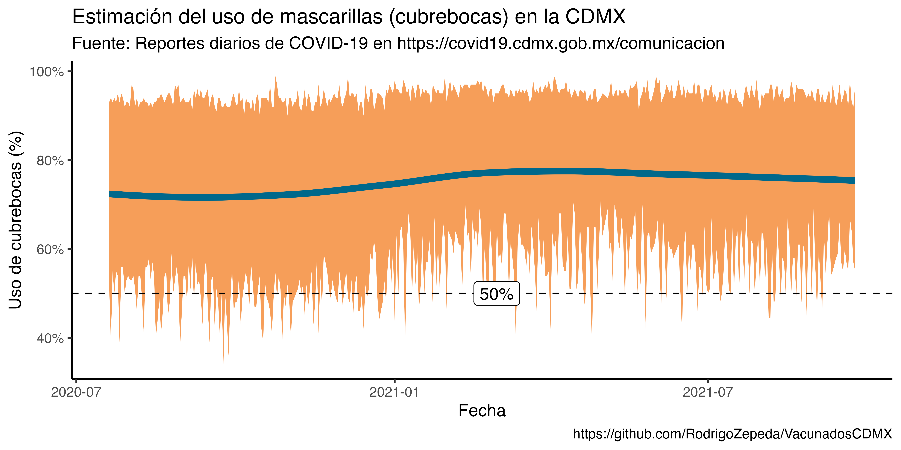

# VacunadosCDMX
Repositorio de datos de vacunados en CDMX según los reportes diarios de COVID en https://covid19.cdmx.gob.mx/comunicacion/tipo/Reporte%20diario%20sobre%20COVID-19

## Archivos

+ `download_pdf_reports` descarga todos los reportes de COVID-19 de la página de la CDMX. 

## Días faltantes

Días que no están en la página: 
+ 22/11/2020
+ 24/12/2020
+ 28/01/2021
+ 10/03/2021
+ 29/04/2021
+ 19/05/2021
+ 13/06/2021
+ 12/09/2021
+ 30/11/2021

Los días se empezaron a reportar desde el 06 mayo 2020

## Vacunas

El 1o de marzo del 2021 es que se empiezan a reportar el total de vacunados por colonia. 

## Mascarillas
El 20 de julio de 2020 comienza a reportarse mascarillas en el mismo formato (tabla).
El 25 de octubre del 2021 se cambió el formato y dejaron de reportar uso de mascarillas.